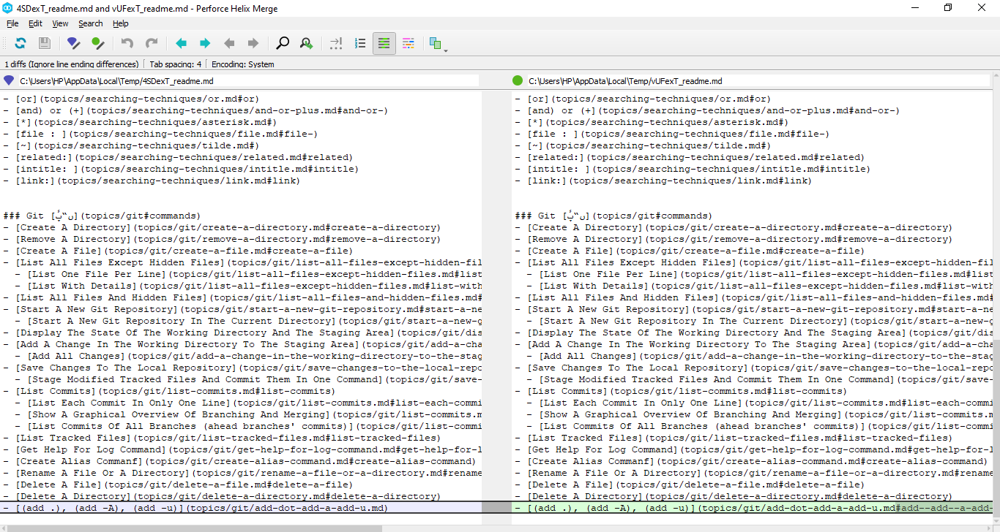

# Compare Differences Between Two Commits

`git diff <commit_1> <commit_2>`

**Example**
```
$ git diff fdac8d6 d60d80c
```

**result**
```diff
diff --git a/readme.md b/readme.md
index 2fcefa7..414b063 100644
--- a/readme.md
+++ b/readme.md
@@ -87,4 +87,4 @@ Note: click on the folder icon `📁` to redirect to the topic's directory
 - [Rename A File Or A Directory](topics/git/rename-a-file-or-a-directory.md#rename-a-file-or-a-directory)
 - [Delete A File](topics/git/delete-a-file.md#delete-a-file)
 - [Delete A Directory](topics/git/delete-a-directory.md#delete-a-directory)
-- [(add .), (add -A), (add -u)](topics/git/add-dot-add-a-add-u.md)
\ No newline at end of file
+- [(add .), (add -A), (add -u)](topics/git/add-dot-add-a-add-u.md#add--add--a-add--u)
\ No newline at end of file
```

---
We can use `difftool` to run the difftool programm.
```
$ git difftool fdac8d6 d60d80c
```


## Compare Differences Between Changes In The Working Directory And Head

`git diff head`

**Example**
```
$ git diff head
```

**result**
```diff
diff --git a/readme.md b/readme.md
index 414b063..b4712bb 100644
--- a/readme.md
+++ b/readme.md
@@ -87,4 +87,5 @@ Note: click on the folder icon `📁` to redirect to the topic's directory
 - [Rename A File Or A Directory](topics/git/rename-a-file-or-a-directory.md#rename-a-file-or-a-directory)
 - [Delete A File](topics/git/delete-a-file.md#delete-a-file)
 - [Delete A Directory](topics/git/delete-a-directory.md#delete-a-directory)
-- [(add .), (add -A), (add -u)](topics/git/add-dot-add-a-add-u.md#add--add--a-add--u)
\ No newline at end of file
+- [(add .), (add -A), (add -u)](topics/git/add-dot-add-a-add-u.md#add--add--a-add--u)
+- [Compare Differences Between Two Commits](topics/git/compare-differences-between-two-commits.md#compare-differences-between-two-commits)
```